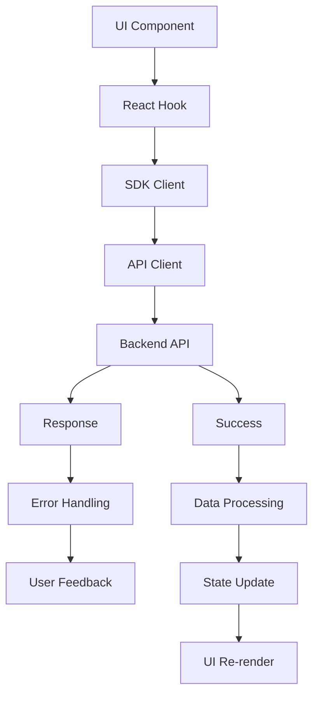

# Frontend Data Flow Architecture

## Request Flow: UI → SDK → Backend



## Detailed Data Flow

### 1. **User Interaction**
```typescript
// User clicks "Enable Automation"
<Button onClick={() => toggleAutomation(true)}>
  Enable Automation
</Button>
```

### 2. **Hook Layer**
```typescript
// src/features/automations/hooks.ts
export function useToggleAutomation(triggerKey: string) {
  const updateAutomations = useUpdateAutomations();
  
  return {
    toggle: async (enabled: boolean) => {
      await updateAutomations.mutateAsync({
        [triggerKey]: { ...currentConfig, enabled }
      });
    }
  };
}
```

### 3. **SDK Layer**
```typescript
// src/sdk/index.ts
async updateAutomations(params: { shop: string; payload: AutomationsUpdateRequest }) {
  const searchParams = new URLSearchParams({ shop: params.shop });
  return this.makeRequest(`/automations?${searchParams}`, {
    method: 'PUT',
    body: JSON.stringify(params.payload),
  });
}
```

### 4. **API Client Layer**
```typescript
// src/lib/apiClient.ts
async updateAutomations(params: { shop: string; payload: any }) {
  return this.handleRequest(
    () => apiClient.updateAutomations(params),
    'updateAutomations'
  );
}
```

### 5. **Request Headers**
```typescript
// Headers added to all requests
const headers = {
  'Authorization': `Bearer ${token}`,
  'X-Shop-Domain': shopDomain,
  'X-Request-ID': requestId,
  'Content-Type': 'application/json',
};
```

### 6. **Backend API**
```
PUT /automations?shop=test-shop.myshopify.com
Authorization: Bearer <jwt_token>
X-Shop-Domain: test-shop.myshopify.com
X-Request-ID: <uuid>
Content-Type: application/json

{
  "abandoned": {
    "enabled": true,
    "template": "Hello {{customer_name}}!",
    "rules": { ... }
  }
}
```

## Error Handling Flow

### 1. **API Error Response**
```json
{
  "error": "validation_failed",
  "message": "Template is too long",
  "code": 422,
  "details": {
    "field": "template",
    "max_length": 160
  }
}
```

### 2. **Error Taxonomy Mapping**
```typescript
// src/lib/apiClient.ts
const ERROR_TAXONOMY = {
  '422': {
    title: 'Validation Error',
    message: 'Please check your input and try again.',
    action: 'Fix',
    tone: 'warning' as const,
  },
  '429': {
    title: 'Rate Limited',
    message: 'Too many requests. Please wait a moment.',
    action: 'Retry',
    tone: 'warning' as const,
  },
  '500': {
    title: 'Server Error',
    message: 'Something went wrong. Please try again later.',
    action: 'Retry',
    tone: 'critical' as const,
  },
};
```

### 3. **User Feedback**
```typescript
// Error banner displayed to user
<Banner tone="warning">
  <Text as="p">Please check your input and try again.</Text>
  <Button onClick={retry}>Fix</Button>
</Banner>
```

## State Management Flow

### 1. **TanStack Query State**
```typescript
// Query state management
const { data, isLoading, error } = useQuery({
  queryKey: ['automations', shop] as const,
  queryFn: () => apiClient.getAutomations({ shop }),
  gcTime: 5 * 60 * 1000, // 5 minutes
  retry: 1,
  refetchOnWindowFocus: false,
});
```

### 2. **Optimistic Updates**
```typescript
// Optimistic update with rollback
const updateAutomations = useMutation({
  mutationFn: (payload) => apiClient.updateAutomations({ shop, payload }),
  onMutate: async (newData) => {
    // Cancel outgoing refetches
    await queryClient.cancelQueries({ queryKey: ['automations', shop] });
    
    // Snapshot previous value
    const previousData = queryClient.getQueryData(['automations', shop]);
    
    // Optimistically update
    queryClient.setQueryData(['automations', shop], (old) => ({
      ...old,
      ...newData,
    }));
    
    return { previousData };
  },
  onError: (err, newData, context) => {
    // Rollback on error
    if (context?.previousData) {
      queryClient.setQueryData(['automations', shop], context.previousData);
    }
  },
  onSettled: () => {
    // Refetch after mutation
    queryClient.invalidateQueries({ queryKey: ['automations', shop] });
  },
});
```

### 3. **React Context State**
```typescript
// Shop context for global state
const ShopContext = createContext<{
  shop: string | null;
  host: string | null;
  setShop: (shop: string) => void;
}>({
  shop: null,
  host: null,
  setShop: () => {},
});

export function ShopProvider({ children }: { children: React.ReactNode }) {
  const [shop, setShop] = useState<string | null>(null);
  const [host, setHost] = useState<string | null>(null);
  
  return (
    <ShopContext.Provider value={{ shop, host, setShop }}>
      {children}
    </ShopContext.Provider>
  );
}
```

## Caching Strategy

### 1. **Query Caching**
```typescript
// Different cache times for different data types
const CACHE_TIMES = {
  health: 60 * 1000,        // 1 minute
  automations: 5 * 60 * 1000, // 5 minutes
  campaigns: 10 * 60 * 1000,  // 10 minutes
  reports: 10 * 60 * 1000,    // 10 minutes
  settings: 10 * 60 * 1000,   // 10 minutes
};
```

### 2. **Cache Invalidation**
```typescript
// Invalidate related queries after mutations
const updateCampaign = useMutation({
  mutationFn: (data) => apiClient.updateCampaign(data),
  onSuccess: () => {
    // Invalidate related queries
    queryClient.invalidateQueries({ queryKey: ['campaigns'] });
    queryClient.invalidateQueries({ queryKey: ['campaign', id] });
  },
});
```

### 3. **Background Refetching**
```typescript
// Background refetch for real-time data
const { data: health } = useQuery({
  queryKey: ['health'] as const,
  queryFn: () => apiClient.getHealth(),
  gcTime: 60 * 1000,
  refetchInterval: 30 * 1000, // Refetch every 30 seconds
});
```

## Performance Optimizations

### 1. **Bundle Splitting**
```typescript
// vite.config.ts
export default defineConfig({
  build: {
    rollupOptions: {
      output: {
        manualChunks: {
          vendor: ['react', 'react-dom'],
          polaris: ['@shopify/polaris'],
          query: ['@tanstack/react-query'],
          router: ['react-router-dom'],
        },
      },
    },
  },
});
```

### 2. **Lazy Loading**
```typescript
// Lazy load heavy components
const CampaignDetail = lazy(() => import('./pages/CampaignDetail'));
const Reports = lazy(() => import('./pages/Reports'));
```

### 3. **Memoization**
```typescript
// Memoize expensive calculations
const processedData = useMemo(() => {
  return data?.map(item => ({
    ...item,
    processed: expensiveCalculation(item),
  }));
}, [data]);
```

## Telemetry Flow

### 1. **Event Tracking**
```typescript
// src/lib/telemetry.ts
export class Telemetry {
  track(event: string, properties?: Record<string, any>) {
    // Send to analytics service
    console.log('Telemetry:', event, properties);
  }
  
  trackPageView(page: string) {
    this.track('page_viewed', { page });
  }
  
  trackFeatureUsed(feature: string, action: string) {
    this.track('feature_used', { feature, action });
  }
}
```

### 2. **Performance Monitoring**
```typescript
// Track performance metrics
const performanceMonitor = new PerformanceMonitor();

// Track page load time
const endPageLoad = performanceMonitor.measurePageLoad('automations');
// ... page loads
endPageLoad();

// Track API call time
const endApiCall = performanceMonitor.measureApiCall('/automations');
// ... API call
endApiCall();
```

## Security Considerations

### 1. **Authentication**
```typescript
// App Bridge token usage
const token = await getSessionToken(app);
const headers = {
  'Authorization': `Bearer ${token}`,
  'X-Shop-Domain': shopDomain,
};
```

### 2. **Shop Scoping**
```typescript
// All requests scoped to shop
const shopDomain = window.location.hostname.replace('.myshopify.com', '') + '.myshopify.com';
```

### 3. **Rate Limiting**
```typescript
// Handle rate limiting
if (response.status === 429) {
  const retryAfter = response.headers.get('Retry-After');
  await new Promise(resolve => setTimeout(resolve, parseInt(retryAfter) * 1000));
  return retryRequest();
}
```

## Error Recovery

### 1. **Retry Logic**
```typescript
// Exponential backoff retry
const retryWithBackoff = async (fn: () => Promise<any>, maxRetries = 3) => {
  for (let i = 0; i < maxRetries; i++) {
    try {
      return await fn();
    } catch (error) {
      if (i === maxRetries - 1) throw error;
      await new Promise(resolve => setTimeout(resolve, Math.pow(2, i) * 1000));
    }
  }
};
```

### 2. **Fallback UI**
```typescript
// Fallback for failed requests
if (error) {
  return (
    <EmptyState
      heading="Failed to load automations"
      image="https://cdn.shopify.com/shopifycloud/web/assets/v1/empty-state-illustration.svg"
    >
      <Button onClick={retry}>Try Again</Button>
    </EmptyState>
  );
}
```

This data flow architecture ensures reliable, performant, and user-friendly data management throughout the application.
